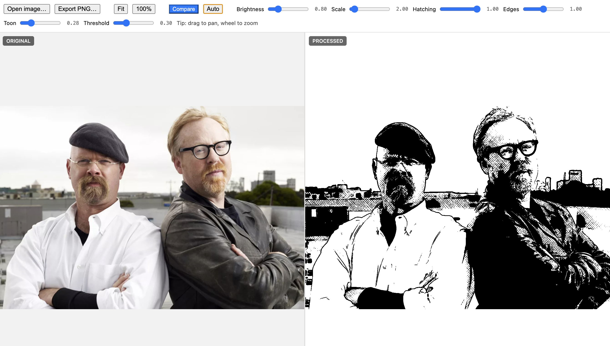

# Crosshatch

An Electron app that transforms images into comic book / crosshatch style artwork using WebGL2 shaders.



## Features

- Real-time image processing with WebGL2
- Comic book style rendering with bold outlines and hatching
- Side-by-side comparison view
- Auto button for intelligent slider presets based on image analysis
- Pan and zoom controls
- Export to PNG

## Controls

| Slider | Description |
|--------|-------------|
| Brightness | Adjusts image exposure before processing |
| Scale | Hatch texture tiling scale |
| Hatching | Amount of crosshatch texture (0 = clean, 1 = full) |
| Edges | Edge detection strength for outlines |
| Toon | Shadow/midtone boundary threshold |
| Threshold | Midtone/highlight boundary |

## Usage

```bash
npm install
npm start
```

1. Click **Open image** to load an image
2. Adjust sliders to taste, or click **Auto** for suggested settings
3. Click **Compare** to see original vs processed side-by-side
4. Click **Export PNG** to save the result

## Requirements

- Node.js 18+
- npm
